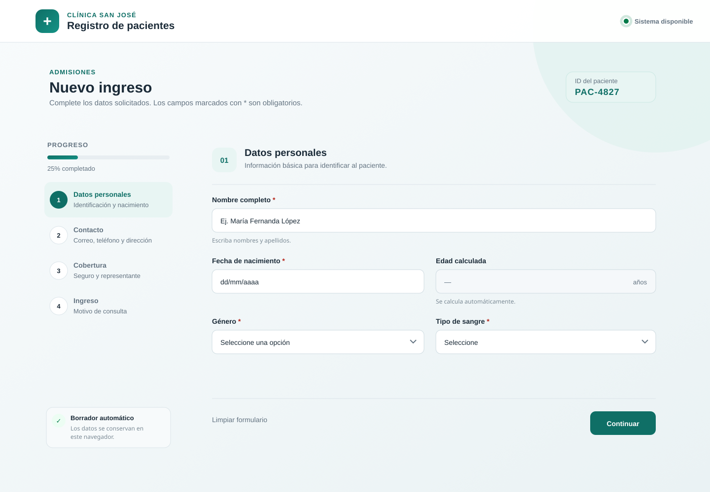

# Formulario de Registro de Pacientes — Clínica San José



## Descripción del proyecto

Este proyecto presenta el rediseño digital del formulario de ingreso de pacientes de la **Clínica San José**. El sistema heredado mostraba 18 campos en una sola pantalla, obligaba a escribir opciones cerradas manualmente, no validaba la información en tiempo real y solicitaba datos que no correspondían a todos los pacientes.

La propuesta consiste en un **formulario web dinámico, responsive y dividido en cuatro pasos**, desarrollado con HTML, CSS y JavaScript. Su objetivo es disminuir errores de captura, reducir el tiempo de registro y mostrar únicamente los campos que correspondan a cada paciente.

> **Actividad:** Rediseño de Entradas Efectivas — Formularios e Interacción  
> **Integrante:** Juan Pablo Rovayo Delgado

---

## Objetivo

Diseñar una interfaz de entrada que permita:

- Capturar únicamente los datos necesarios.
- Utilizar controles apropiados para cada tipo de información.
- Validar correo, teléfono, fechas y campos obligatorios en tiempo real.
- Calcular la edad automáticamente desde la fecha de nacimiento.
- Mostrar los datos del representante solo para menores de edad.
- Mostrar aseguradora y póliza únicamente cuando el paciente tenga seguro.
- Conservar temporalmente la información ingresada para evitar pérdidas accidentales.
- Funcionar correctamente en computadoras, tabletas y teléfonos móviles.

---

## Paso 1: Análisis de deficiencias y selección de controles

### 1. Captura manual de opciones cerradas

**Descripción del problema:** El formulario anterior pedía escribir manualmente valores como género, tipo de sangre y respuesta de seguro médico. Esto permitía variaciones como “SI”, “Sí”, “S”, “O positivo” o datos no válidos, lo que afectaba la consistencia de la información.

**Control propuesto y justificación:** Se utilizaron controles `select` para género y tipo de sangre, además de botones de opción para indicar si el paciente tiene seguro. Estos controles limitan la entrada a opciones válidas, reducen errores de escritura y aceleran el registro.

### 2. Campos obligatorios que no corresponden a todos los pacientes

**Descripción del problema:** Los adultos debían completar los campos del representante legal con guiones o valores vacíos. De igual forma, los pacientes sin seguro estaban obligados a escribir “NO TIENE” en los campos de aseguradora y póliza.

**Control o lógica propuesta y justificación:** Se aplicó lógica condicional. Los campos de representante legal aparecen únicamente cuando la edad calculada es menor de 18 años. Los datos del seguro se muestran solo cuando se selecciona “Sí, tiene seguro”. Esto aplica el principio KISS y evita pedir información innecesaria.

### 3. Fechas, edad y hora ingresadas manualmente

**Descripción del problema:** La fecha de nacimiento, edad, fecha de ingreso y hora de ingreso debían escribirse manualmente, lo que generaba formatos inconsistentes, edades incorrectas y duplicación de información.

**Control o lógica propuesta y justificación:** Se utilizó `input type="date"` para la fecha de nacimiento, se calculó la edad automáticamente y se asignaron la fecha y hora de ingreso desde el sistema. De esta manera se elimina la redundancia y se mejora la precisión de los datos.

---

## Paso 2: Tabla de respuesta a eventos

| Evento del usuario | Acción del sistema | Feedback visual en pantalla | Feedback textual |
| :--- | :--- | :--- | :--- |
| Selecciona una fecha de nacimiento | Calcula automáticamente la edad y determina si es menor de edad | Se actualiza el campo de edad y, si corresponde, aparece la sección del representante | “Obligatorio para pacientes menores de 18 años” |
| Selecciona “Sí, tiene seguro” | Muestra y vuelve obligatorios los campos de aseguradora y póliza | La sección aparece dentro de un bloque diferenciado | “Datos del seguro — Requeridos por la selección anterior” |
| Selecciona “No tiene seguro” | Oculta los campos de aseguradora y póliza | Desaparece la sección condicional sin recargar la página | No solicita información que no corresponde |
| Escribe un correo o teléfono inválido | Valida el formato mientras el usuario escribe | El campo muestra borde, fondo de error e indicador textual | “Ingrese un correo válido” o “Ingrese exactamente 10 dígitos” |
| Presiona “Continuar” con campos vacíos | Detiene el avance y enfoca el primer campo incorrecto | Campos inválidos resaltados y alerta superior | “Revise los campos marcados antes de continuar” |
| Presiona “Limpiar formulario” | Solicita confirmación antes de eliminar los datos | Ventana modal de advertencia | “¿Limpiar el formulario? Se eliminarán los datos guardados” |
| Presiona “Registrar paciente” con información válida | Valida todos los pasos y simula el registro | Botón cambia a “Registrando…” y luego aparece una confirmación | “Paciente registrado. La información fue validada correctamente” |

---

## Paso 3: Justificación teórica del diseño

### Modelo conceptual de la entrada

#### Información: qué capturar

Se conservaron los datos necesarios para la identificación, contacto, cobertura y motivo de consulta. Se eliminó la captura manual de la edad porque puede obtenerse a partir de la fecha de nacimiento. También se automatizaron el identificador del paciente, la fecha de ingreso y la hora de ingreso.

Los datos de aseguradora, póliza y representante legal se mantienen ocultos hasta que sean necesarios. Esto evita registrar valores falsos como “NO TIENE” o guiones, y mejora la calidad de la base de datos.

#### Presentación: cómo capturar

El formulario fue dividido en cuatro pasos:

1. Datos personales.
2. Información de contacto.
3. Cobertura y representante.
4. Datos del ingreso.

Los campos relacionados se presentan juntos, los obligatorios están claramente marcados y cada control corresponde al tipo de información solicitado. Se utilizan fechas visuales, listas desplegables, botones de opción, campos de correo y teléfono, además de un área de texto para el motivo de consulta.

#### Contexto: quién y dónde

La interfaz puede ser utilizada por recepcionistas que necesitan completar registros rápidamente y por pacientes desde dispositivos móviles. Por esta razón, el diseño reduce clics innecesarios, utiliza etiquetas claras, botones grandes y una estructura responsive.

El guardado automático del borrador evita perder la información si la página se actualiza accidentalmente. Asimismo, la validación inmediata reduce correcciones posteriores y evita que el formulario se reinicie ante un error.

### Principios de diseño y color aplicados

#### KISS y simplicidad

Se muestra únicamente la información necesaria en cada momento. El formulario largo se divide en pasos cortos y los campos condicionales permanecen ocultos hasta que una respuesta previa los vuelve relevantes. La edad, fecha, hora e identificador se generan automáticamente.

#### Consistencia

Todos los campos mantienen la misma estructura de etiqueta, control, ayuda y mensaje de error. Los botones principales conservan el mismo color y posición, los espacios son uniformes y las acciones similares producen retroalimentación similar.

#### Color, contraste y accesibilidad

El color verde azulado identifica las acciones principales y transmite confianza, mientras que el rojo se reserva para errores. Sin embargo, el sistema no depende únicamente del color: cada error incluye un mensaje textual y un símbolo. Los campos tienen etiquetas visibles, estados de foco claros y mensajes anunciados mediante regiones `aria-live`.

El fondo claro, el texto oscuro y los controles con bordes definidos proporcionan contraste suficiente. El diseño también permite navegación mediante teclado y utiliza controles HTML semánticos.

---

## Paso 4: Evidencia del diseño digital

- **Tecnología utilizada:** HTML5, CSS3 y JavaScript.
- **Tipo de propuesta:** Formulario web dinámico y responsive.
- **Enlace al prototipo digital:** _Pegar aquí el enlace de GitHub Pages._
- **Instrucciones:** Abrir el archivo `index.html` en un navegador o visitar el enlace publicado con GitHub Pages.

---

## Funcionalidades implementadas

- Formulario dividido en cuatro pasos.
- Barra de progreso y navegación entre secciones.
- Generación automática del identificador del paciente.
- Cálculo automático de edad.
- Campos condicionales para seguro y representante legal.
- Validación en tiempo real.
- Mensajes específicos de error.
- Contador de caracteres para el motivo de consulta.
- Fecha y hora de ingreso automáticas.
- Borrador guardado en `localStorage`.
- Confirmación antes de limpiar el formulario.
- Mensaje final de registro exitoso.
- Diseño responsive y accesible.

---

## Estructura del repositorio

```text
formulario_registro_pacientes/
├── assets/
│   └── formulario-registro-pacientes.png
├── index.html
├── styles.css
├── script.js
└── README.md
```

---

## Cómo ejecutar el proyecto

1. Descargar o clonar el repositorio.
2. Abrir la carpeta del proyecto en Visual Studio Code.
3. Abrir `index.html` directamente en el navegador o utilizar la extensión Live Server.
4. Completar los pasos del formulario para comprobar las validaciones y los campos condicionales.

---

## Publicación en GitHub Pages

1. Subir los archivos a la raíz de un repositorio público.
2. Entrar en `Settings` → `Pages`.
3. En `Source`, seleccionar `Deploy from a branch`.
4. Seleccionar la rama `main` y la carpeta `/(root)`.
5. Guardar y esperar a que GitHub genere el enlace público.
6. Copiar el enlace en la sección “Enlace al prototipo digital” de este README.

---

## Conclusión

El rediseño transforma un formulario extenso y propenso a errores en una entrada digital clara, dinámica y consistente. La selección adecuada de controles, la validación inmediata, el cálculo automático y la aparición condicional de campos reducen el esfuerzo del usuario y mejoran la precisión de la información registrada.
